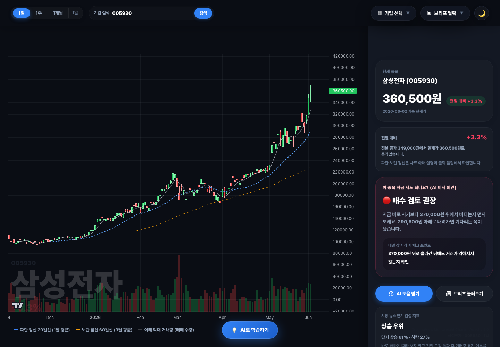
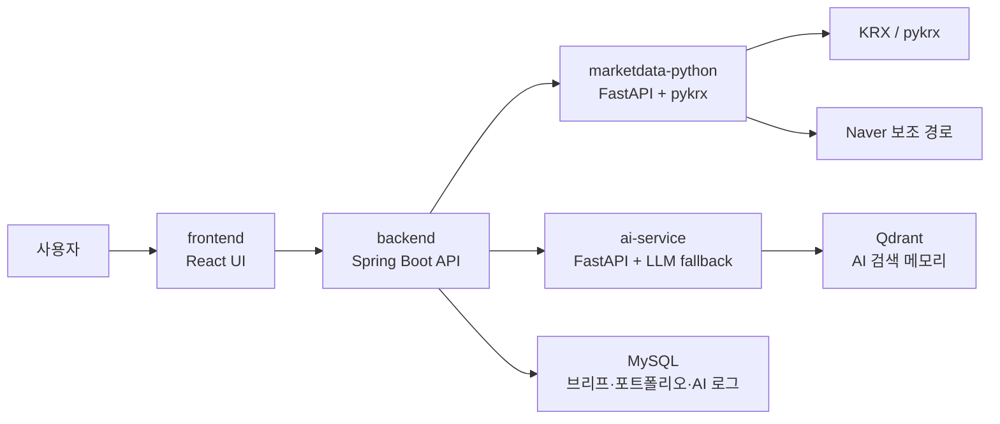

# oh-my-krx

[](https://github.com/8luerose/oh-my-krx)


**oh-my-krx**는 한국 주식 차트와 시장 브리프를 한 화면에서 확인하고, AI로 차트 추세와 주식 용어를 이해할 수 있게 만든 프로젝트입니다.

주식 데이터 수집, 차트 화면, AI 설명을 각각 분리해서 만들었습니다. 그래서 데이터가 어디서 오는지 확인할 수 있고, 차트는 실제 서비스처럼 보기 쉽게 구성했습니다.

> 매수와 매도를 대신 결정하는 서비스가 아닙니다. 차트와 데이터를 이해하고 스스로 판단할 수 있게 돕는 도구입니다.



## 주요 기능

| 기능 | 설명 |
| --- | --- |
| **KRX 기반 차트 조회** | `marketdata-python`이 `pykrx`를 통해 국내 주식 OHLCV 데이터를 가져옵니다. |
| **TradingView 오픈소스 차트** | `lightweight-charts`로 캔들, 이동평균선, 거래량을 보기 쉽게 표시합니다. |
| **AI 차트 분석** | 현재 종목의 차트, 이벤트, 뉴스 후보를 바탕으로 가격 움직임과 확인할 가격대를 알려줍니다. |
| **AI 매수·매도 검토** | 매수 검토, 매도 검토, 대기 조건, 리스크 관리 기준을 나눠 보여줍니다. |
| **AI 주식 용어 학습** | 차트 화면에서 낯선 용어를 바로 확인하고, 실제 종목의 가격 변화와 연결해 이해할 수 있습니다. |
| **브리프 달력** | 날짜별 상승·하락 TOP3, 최다 언급 종목, KOSPI·KOSDAQ 대표 종목을 확인합니다. OpenClaw 같은 자동화 도구에서는 API만 호출해 브리프 데이터만 따로 받을 수 있습니다. |
| **매일 브리프 불러오기** | 최신 시장 브리프와 AI 장후 리포트를 불러와 하루 시장 내용을 빠르게 확인할 수 있습니다. |

## 문제 정의

국내 주식 차트를 공부할 때는 차트, 뉴스, 거래량, 이동평균선, 용어 설명이 따로 떨어져 있는 경우가 많습니다.

oh-my-krx는 이 정보를 한 화면에 모아 다음 과정으로 볼 수 있게 만들었습니다.

```text
종목 선택
  -> KRX 기반 차트 조회
  -> 이벤트·뉴스·거래 구간 확인
  -> AI 차트 분석
  -> 필요한 용어 학습
```

## 실행 전 준비물

| 준비물 | 필수 여부 | 설명 |
| --- | --- | --- |
| **Git** | 필수 | GitHub 저장소를 내려받을 때 필요합니다. |
| **Docker Desktop** | 필수 | MySQL, backend, frontend, marketdata, ai-service, Qdrant를 함께 실행합니다. |
| **Docker Compose** | 필수 | `docker compose up` 또는 `make up` 실행에 필요합니다. Docker Desktop에 보통 포함되어 있습니다. |
| **make** | 권장 | 자주 쓰는 Docker 명령을 짧게 실행할 수 있습니다. |
| **Ollama** | 선택 | 로컬 AI 모델로 차트 분석과 용어 설명을 받아보고 싶을 때 사용합니다. 없어도 기본 화면은 동작합니다. |
| **KRX Data Portal 계정** | 선택 | KRX 인증 경로를 사용할 때 `.env`에 `KRX_ID`, `KRX_PW`를 입력합니다. |

Ollama를 사용할 때는 호스트 PC에 Ollama와 모델이 설치되어 있어야 합니다.

```dotenv
LLM_PROVIDER=ollama
OLLAMA_BASE_URL=http://host.docker.internal:11434
OLLAMA_MODEL=auto
```

KRX 계정 정보가 있으면 `.env`에만 입력합니다.

```dotenv
KRX_AUTH_ENABLED=auto
KRX_ID=
KRX_PW=
```

## 빠른 시작

```bash
git clone https://github.com/8luerose/oh-my-krx.git
cd oh-my-krx
cp .env.example .env
make up
make health
```

접속 주소:

- 앱: http://localhost:5173
- 백엔드 상태: http://localhost:8080/actuator/health
- 시장 데이터 상태: http://localhost:8000/health
- AI 서비스 상태: http://localhost:8100/health

## 자주 쓰는 명령

```bash
make up              # 전체 서비스 빌드 및 실행
make health          # 서비스 상태 확인
make logs            # 전체 서비스 로그 확인
make generate-today  # 오늘 날짜 시장 브리프 생성
make latest          # 최신 시장 브리프 조회
make ollama-status   # AI 서비스와 Ollama 연결 상태 확인
make down            # 컨테이너 중지
```

## 아키텍처



| 폴더 | 역할 |
| --- | --- |
| `frontend/` | React 화면, 캔들차트, AI 패널, 학습 시트 |
| `backend/` | Spring Boot API, 데이터 저장, marketdata/AI 프록시 |
| `marketdata-python/` | KRX/pykrx 기반 차트·브리프·뉴스 데이터 수집 |
| `ai-service/` | Ollama 또는 외부 LLM 기반 AI 응답과 규칙 기반 보조 응답 |
| `backend/src/main/resources/db/migration/` | Flyway 기반 MySQL 스키마 |

## 데이터 이동 경로

### 종목 차트

```text
frontend
  -> backend /api/stocks/{code}/chart
  -> StockController
  -> StockResearchClient
  -> marketdata-python /stocks/{code}/chart
  -> pykrx OHLCV
  -> 실패 시 Naver OHLCV 보조 경로
```

### 브리프 달력

```text
브리프 달력 날짜 클릭
  -> backend /api/summaries/{date}
  -> 저장된 브리프 조회
  -> 없거나 갱신이 필요하면 /api/summaries/{date}/generate
  -> marketdata /leaders
  -> KRX/pykrx 기준 시장 브리프 생성
```

현재 화면에서는 주요 KOSPI 종목을 차트에서 확인할 수 있고, 브리프 달력에서는 날짜별 시장 데이터를 아래 형식으로 볼 수 있습니다.

OpenClaw를 사용하는 환경에서는 화면을 열지 않고 `GET /api/summaries/{date}` 또는 `POST /api/summaries/{date}/generate`만 호출해 브리프 데이터만 따로 받을 수 있습니다. 다음 단계에서는 사용자가 원하는 기업과 종목을 직접 선택해 같은 방식의 브리프를 받아볼 수 있게 확장할 예정입니다.

```text
📊 [2026-06-01] 한국 주식 일간 브리프 (전일 대비)

🟢 KOSPI 상승 1위: LG헬로비전 (037560) 30.0%
🔴 KOSPI 하락 1위: 에이리츠 (140910) -24.41%
🟢 KOSDAQ 상승 1위: 로보스타 (090360) 30.0%
🔴 KOSDAQ 하락 1위: 조이웍스앤코 (309930) -29.39%

💬 최다 언급: 코오롱티슈진 (60건) — 출처: 네이버 종목토론방
🏆 KOSPI 픽: LG헬로비전 (037560) 30.0%
🏆 KOSDAQ 픽: 로보스타 (090360) 30.0%

📈 KOSPI 전일대비 상승 TOP3:
LG헬로비전 (037560) +30.0%
LG전자우 (066575) +29.99%
두산로보틱스 (454910) +29.95%

📉 KOSPI 전일대비 하락 TOP3:
에이리츠 (140910) -24.41%
삼화콘덴서 (001820) -23.54%
동국홀딩스 (001230) -15.12%

📈 KOSDAQ 전일대비 상승 TOP3:
로보스타 (090360) +30.0%
팸텍 (271830) +29.95%
오브젠 (417860) +29.9%

📉 KOSDAQ 전일대비 하락 TOP3:
조이웍스앤코 (309930) -29.39%
비유테크놀러지 (230980) -28.57%
헝셩그룹 (900270) -25.61%
```

### AI 분석

```text
차트 데이터 + 이벤트 + 뉴스 + 시장 브리프
  -> backend /api/ai/*
  -> ai-service
  -> Ollama 또는 외부 LLM 설정
  -> 실패 시 규칙 기반 응답
```

## 주요 API

| 영역 | API |
| --- | --- |
| 요약 조회 | `GET /api/summaries?from=YYYY-MM-DD&to=YYYY-MM-DD` |
| 최신 브리프 | `GET /api/summaries/latest` |
| 오늘 생성 | `POST /api/summaries/generate/today` |
| 종목 차트 | `GET /api/stocks/{code}/chart?range=6M&interval=daily` |
| 이벤트 | `GET /api/stocks/{code}/events?from=YYYY-MM-DD&to=YYYY-MM-DD` |
| 뉴스 | `GET /api/stocks/{code}/news?limit=8` |
| 매수·매도 검토 구간 | `GET /api/stocks/{code}/trade-zones?riskMode=neutral` |
| AI 채팅 | `POST /api/ai/chat` |
| AI 인사이트 | `POST /api/ai/ollama/insights` |
| AI 장후 리포트 | `GET /api/ai/ollama/after-market-report/latest` |
| 용어 학습 | `GET /api/learning/terms`, `POST /api/learning/assistant` |
| 포트폴리오 | `GET /api/portfolio`, `POST /api/portfolio/items` |

## 데이터 출처와 역할

| 항목 | 역할 |
| --- | --- |
| KRX / pykrx | 한국 주식 OHLCV 데이터의 우선 경로 |
| Naver OHLCV | pykrx 실패 시 사용하는 보조 경로 |
| TradingView 오픈소스 `lightweight-charts` | 데이터를 가져오는 곳이 아니라 차트를 그리는 렌더러 |
| AI 서비스 | 수집된 차트·뉴스·브리프를 바탕으로 설명을 만드는 계층 |
| MySQL | 시장 브리프, 포트폴리오, AI 로그 저장 |
| Qdrant | AI 검색과 메모리 확장을 위한 벡터 저장소 |
